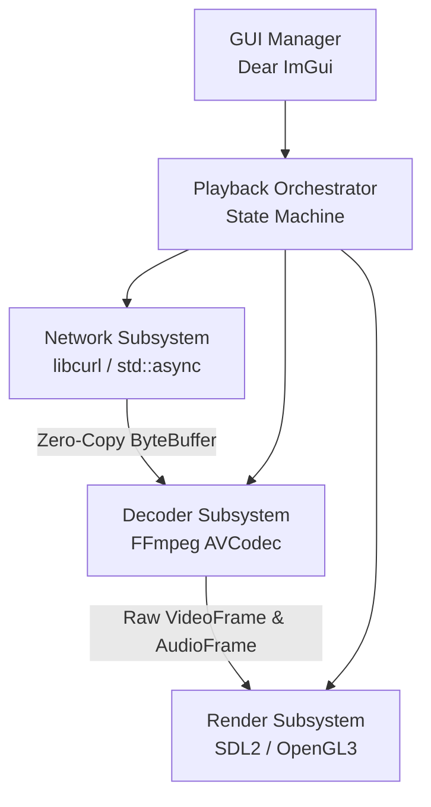

  
  <h1>VSMN-Player</h1>
  
<strong>A Production-Grade, Zero-Copy IPTV Player built in Modern C++20</strong>

  
  
  
  
  
  

---

## 🚀 The Vision

**VSMN-Player** is not just another media player. It's an **industrial-grade engineering showcase** designed from the ground up to demonstrate mastery of modern C++20, advanced software architecture, and highly automated DevSecOps pipelines.

Engineered with a **Zero-Copy Memory Architecture** and heavily influenced by **Data-Oriented Design (DOD)** for L1 cache alignment, this player aims to handle 4K HLS/M3U8 streams with theoretical minimum latency and CPU overhead.

## ✨ Key Technical Achievements

- **Modern C++20:** Heavy use of `std::span`, `std::variant`, Concepts, and `std::stop_token` for safe concurrency without boilerplate.
- **Zero-Copy Pipeline:** Network buffers (`ByteBuffer`) and parsed AV frames (`VideoFrame`, `AudioFrame`) are passed via move-semantics. No deep copies.
- **Dependency Injection & Interfaces:** Fully testable architecture with mocked subsystems (Network, Decoder, Render) for isolated unit testing.
- **Industrial Tooling:**
  - **Static Analysis:** `clang-tidy`, `cppcheck`, and strict `clang-format` enforcement.
  - **Memory Safety:** Aggressive use of Google's `AddressSanitizer` (ASan), `UBSan`, and `ThreadSanitizer` (TSan) in the CI pipeline.
  - **Package Management:** Conan 2.0 orchestrating heavy dependencies (FFmpeg, SDL2, Dear ImGui) with absolute version pinning for reproducible builds.
- **Zero-Friction Dev Environment:** 100% Plug & Play development using VSCode DevContainers. Your host machine stays clean.

## 🏗️ Architecture Overview

The system strictly adheres to the **Feature-Sliced Design (FSD)**, keeping domains decoupled and testable:

## 🛠️ Tech Stack

| Domain | Technology | Justification |
|--------|------------|---------------|
| **Language** | `C++20` | Leverages modern concepts, smart pointers, and concurrency features. |
| **Build System** | `CMake` + `Conan 2.0` | Industry standard. Guarantees reproducible builds across Linux/macOS/Windows. |
| **Media Engine** | `FFmpeg (libavcodec)` | The undisputed king of multimedia parsing and decoding. |
| **Window & Input**| `SDL2` | Cross-platform, hardware-accelerated context creation. |
| **UI Framework** | `Dear ImGui` | Immediate Mode GUI. Ultra-lightweight and perfect for high-performance overlays. |
| **Testing** | `GTest` + `gcovr` | Robust unit testing with HTML coverage reports. |

## 🚦 Quick Start (VSCode DevContainers)

This repository is built for **Plug & Play** contribution. You don't need to install any C++ compilers locally.

1. Install [Docker](https://www.docker.com/) and [VSCode](https://code.visualstudio.com/).
2. Clone this repository.
3. Open the folder in VSCode. A prompt will appear: click **"Reopen in Container"**.
4. The container will automatically build a Linux environment, install GCC 13, CMake, FFmpeg, SDL2, and all required VSCode extensions.
5. Hit the **Build** button at the bottom bar to compile!

*(Prefer traditional terminal commands? Check out our [DOCKER.md](DOCKER.md) and [DEVELOPMENT.md](DEVELOPMENT.md) guides).*

## 📖 Deep Dive Documentation

For recruiters or developers wanting to look under the hood:

- [1️⃣ Roadmap & Decision Log](docs/initial/04_IPTV_PLAYER_ROADMAP.md) - Why we chose what we chose.
- [2️⃣ Build System & CI/CD Pipeline](docs/build.md) - How our GitHub Actions matrix works.
- [3️⃣ Testing Strategy](TESTING.md) - How we enforce correctness.
- [4️⃣ Dependency Management](docs/dependencies.md) - Why we use Conan 2.0 over submodules.
- [5️⃣ Docker Architecture](DOCKER.md) - How our multi-stage `Dockerfile.prod` produces microscopic runtime images.

## 🤝 Contributing

We welcome contributions! Please see our [CONTRIBUTING.md](CONTRIBUTING.md) for details on our code of conduct, branching strategy, and pull request process.
