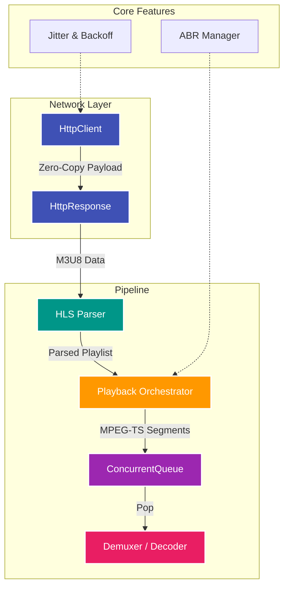

# VSMN-Player: High-Performance C++20 IPTV Engine

Welcome to the technical documentation of **VSMN-Player**, a next-generation IPTV streaming engine built entirely in Modern C++20.

## 🚀 Mission Statement

Our goal is to build an industrial-grade, zero-copy video streaming pipeline capable of handling massive HLS/MPEG-TS manifests with zero dropped frames. This engine is built from the ground up for maximum performance, deterministic memory management, and rigorous thread safety.

## 🔑 Key Architectural Pillars

* **Zero-Copy Native:** Absolute elimination of unnecessary memory allocations. Data flows from the network socket to the decoder without heap fragmentation.
* **Resilient Networking:** Industrial backoff strategies (Full Jitter), anti-stall mechanics, and smart chunking.
* **Thread-Safety Guaranteed:** Engineered for multi-threading and validated continuously by ThreadSanitizer (TSan).
* **Modern C++20 Standard:** Leveraging concepts, ranges, `<charconv>`, and strict move-only semantics to guarantee memory safety at compile time.

## 🏗️ Architecture Overview

Explore the documentation through the navigation menu to deep dive into our network layer, CI/CD pipelines, and API references.
